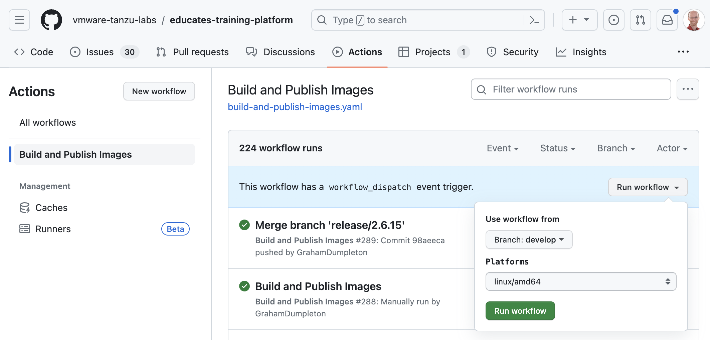

Release Procedures
==================

All changes pertaining to a new release should be worked on in forks of the main Educates GitHub repository, with changes submited via pull requests back to the `develop` branch of the main repository. When it is time for a release, the following steps should be followed.

Updates to the Documentation
----------------------------

Before any release is performed, documentation should first be updated for any changes being made in the release. Documentation updates should consist of:

* Additions or updates to core documentation related to any new features or changes.
* Addition of release notes for the release. This should be added to the [project-docs/release-notes](../project-docs/release-notes) directory.
* Link the release notes into the documentation table of contents. This should be added to [project-docs/index.rst](../project-docs/index.rst).

Where changes are non trivial or need further explanation, the release notes should include a cross reference to other parts of the documentation describing the feature.

Triggering a Development Build
------------------------------

For any individual code changes the developer of the changes should have already built and tested the changes on their local system. If a complete build of Educates consisting of all code changes for a release is required, a build from the `develop` branch can be triggered using a GitHub actions workflow dispatch trigger event. This can be done from the GitHub actions page of the main Educates GitHub repository located at:

* [https://github.com/vmware-tanzu-labs/educates-training-platform/actions](https://github.com/vmware-tanzu-labs/educates-training-platform/actions)



From the GitHub actions page select "Build and Publish Images" from the list of workflows, then click on the "Run workshop" dropdown. In the drop down select the branch `develop` and then the list of platforms to run the build.

By default the build will only be run for the `linux/amd64` platform. The `linux/arm64` platform can instead be selected, or both, by selecting `linux/amd64,linux/arm64`. Note that any `linux/arm64` build will take significantly longer as the build is done under GitHub actions using the QEMU machine emulator and virtualizer.

Being a development build, all the container images, client programs and package bundles will be created, but neither a package repository bundle or GitHub release will be created. To test the release, clients programs and package resource manifests for installing the development version can be downloaded from the build artifacts of the GitHub actions workflow run. Client programs can also be download by using the command:

```
imgpkg pull -i ghcr.io/vmware-tanzu-labs/educates-client-programs:develop -o /tmp/client-programs
```

A development build prior to a release would be done against the main Educates GitHub repository. If necessary a developer of some changes could also trigger such a build using GitHub actions from their fork of the Educates GitHub repository. In this case all container image references will resolve to images built and pushed to the developers GitHub container registry namespace and not that of the main Educates GitHub repository. For more complicated changes, it possibly should be a requirement that a developer do a full development build from their fork and test it before creating a pull request with their changes.

Tagged Pre-release Versions
---------------------------

Development builds created by manually invoking the GitHub actions workflow are mutable and would be replaced by a subsequent development build. If you want to generate a more official pre-release version for testing (alpha, beta, or release candidate), you can create a tag in the Git repository against the corresponding commit in the `develop` branch and push the tag to GitHub. Pushing the tag will automatically trigger the GitHub action workflow to run. As with a development build all the container images, client programs and package bundles will be created. This time a GitHub release will be also be created but marked as pre-release. A package repository will still not be created however.

The format of the tags you can use for pre-release builds are:

* `X.Y.Z-alpha.N`
* `X.Y.Z-beta.N`
* `X.Y.Z-rc.N`

These can be created against a branch of a fork created from the main GitHub repository, in which case the release will be added against the fork and not the main GitHub repository.

Because the same tag might be used in the main GitHub repository, which would be propagated to the fork when the repositories are synchronized, use of these tags is discouraged in forks except for testing release procedures. If done for this purpose, it is suggest that a tag of the form `0.0.1-???.N` be used, and that after testing both the tag and GitHub release be deleted once no longer required, so that the same tag can be used again in such future testing.

Note that pre-release versions created in a fork will only include container images built for the `linux/amd64` platform. If you need for a pre-release version created in a fork to include support for the `linux/arm64` platform, you will need to create a GitHub secret in the repository fork called `TARGET_PLATFORMS` with a value of `linux/arm64` or `linux/amd64,linux/arm64`. Only `linux/amd64` platform support is included by default when builds are done in a fork due to the significantly longer build times required for `linux/arm64`.

Creating the Final Release
--------------------------

The use of a `develop` branch distinct from `main` was due to an original intention to follow a `gitflow` type model for branch management. With repository forks and pull requests in GitHub now being used as the means to manage contributions from distinct developers, the `gitflow` model is not now being strictly adhered to even though the `develop` branch has been retained.

Although it is recommended a Git client supporting the `gitflow` model be used to manage the release, it is not strictly necessary. Either way, the outcome should be:

* The `develop` branch should be merged into the `main` branch.
* The merge commit should be tagged with the version for the final release.
* The `main` branch at the point of the tagged version should be pulled back into the `develop` branch to align the two branches.

The format of the tag you use for a final release should be:

* `X.Y.Z`

Pushing the changes and tag back to GitHub should trigger the GitHub actions workflow for building the project and creating the release.

The GitHub action in this case will result in the creation of all the container images, client programs and package bundles. A GitHub release will be also be created as well as a package repository bundle.

Creation of a final release in a fork should only be done if testing the release process. In this case the version tag `0.0.1` should be used and the tag and GitHub release should be deleted once the test has been completed.

Merging Package Definitions
---------------------------

Upon a successful final release being created by the GitHub actions workflow, a pull request against the `develop` branch will be automatically created back against the GitHub repository. This pull request will contain the package resource definitions for the released version. This pull request should be merged prior to any subsequent release as the the package resource definitions need to exist in the repository so they can be included in the subsequent release. If this is not done then that version will be missing from subsequent versions of the package repository.

In the case of creating a final release in a fork, this pull request will not be created. This is because the only source of package resource definitions should be from the GitHub actions workflow run from the main GitHub repository. Package resource definitions should never be added in a fork, nor merged from a fork to the main GitHub repository.

Adhoc Documentation Updates
---------------------------

The public Educates documentation web site is updated from the `main` branch of the GitHub repository. Where documentation updates neatly fall within the time window for creating a final release, no special steps are required. Updating the public documentation outside of that time window gets more complicated because there may be in progress changes for both Educates code and documentation sitting within the `develop` branch which should not be merged into the `main` branch prior to a release.

Until a better system is created for handling adhoc updates to the public documentation web site, the following is recommended.

1. Ensure that in your repository fork that the `main` branch is up to date with the main repository.
2. When needing to make the documentation changes create the branch from the `main` branch instead of `develop`.
3. Make the required changes in your documentation branch and push your branch to your repository fork.
4. Create the pull request, ensure that it is being made relative to the `main` branch of the main repository and not `develop`.
5. The pull request should then be merged to the `main` branch of the main repository.
6. The `main` branch of the main repository should then be merged back into the `develop` branch.

This process should only be used to make changes which affect the `project-docs` and `developer-docs` directories and which need to be made public in the `main` repository outside of the normal release schedule.
