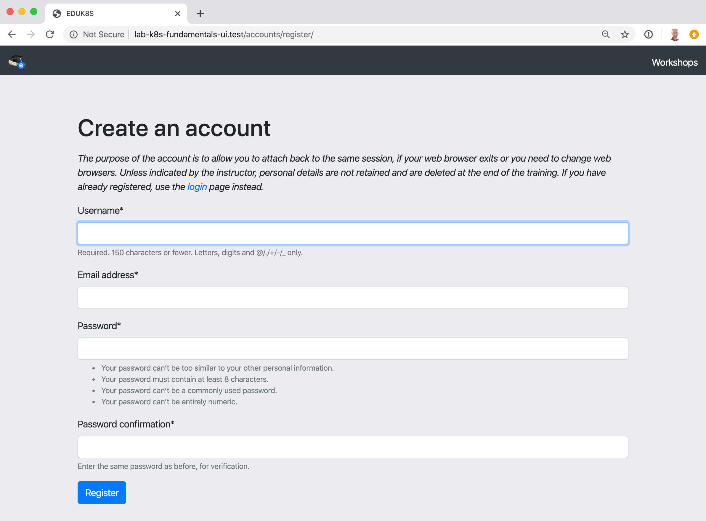
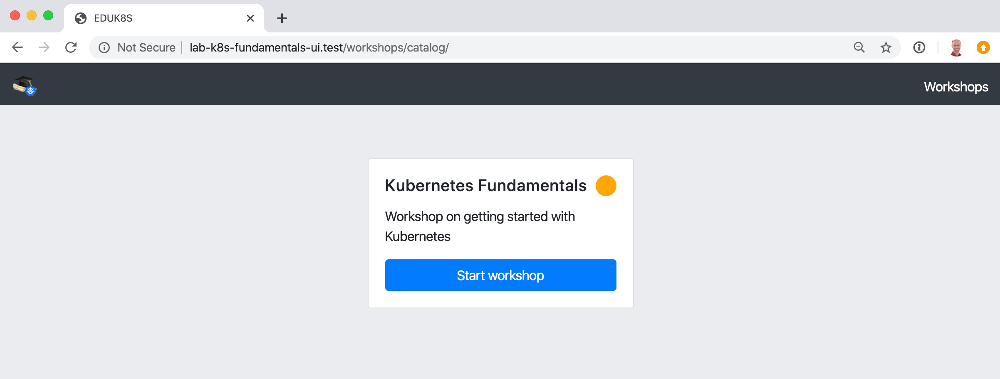

Training Session
================

The quickest way of deploying a set of workshops to use in a training session is to deploy a training portal. This results in the deployment of a set of workshops, with one instance of each workshop for each attendee. A web based portal is provided for registering attendees and allocating them to workshops.

Loading the workshop definition
-------------------------------

Each workshop is described by a custom resource of type ``Workshop``. Before a workshop environment can be created, the definition of the workshop must first be loaded.

The ``Workshop`` custom resource we will be using is:

.. code-block:: yaml

    apiVersion: training.eduk8s.io/v1alpha2
    kind: Workshop
    metadata:
      name: lab-k8s-fundamentals
    spec:
      vendor: eduk8s.io
      title: Kubernetes Fundamentals
      description: Workshop on getting started with Kubernetes
      url: https://github.com/eduk8s-labs/lab-k8s-fundamentals
      content:
        image: quay.io/eduk8s-labs/lab-k8s-fundamentals:master
      duration: 1h
      session:
        budget: medium
        applications:
          terminal:
            enabled: true
            layout: split
          console:
            enabled: true

To load the definition of the workshop, run::

    kubectl apply -f https://raw.githubusercontent.com/eduk8s-labs/lab-k8s-fundamentals/master/resources/workshop.yaml

The custom resource created is cluster scoped, and the command needs to be run as a cluster admin or other appropriate user with permission to create the resource.

If successfully loaded, the command will output::

    workshop.training.eduk8s.io/lab-k8s-fundamentals configured

You can list the workshop definitions which have been loaded, and which can be deployed by running::

    kubectl get workshops

For this workshop, this will output::

    NAME                   IMAGE                                             URL
    lab-k8s-fundamentals   quay.io/eduk8s-labs/lab-k8s-fundamentals:master   https://github.com/eduk8s-labs/lab-k8s-fundamentals

The additional fields provide the container image which will be deployed for the workshop, and a URL where you can find out more information about the workshop.

The definition of a workshop is loaded as a step of its own, rather than referring to a remotely hosted definition, so that a cluster admin can audit the workshop definition and ensure that it isn't doing something they don't want to allow. Once the workshop definition has been approved, then it can be used to create instances of the workshop.

Creating the workshop training portal
-------------------------------------

To deploy a workshop for one or more users, use the ``TrainingPortal`` custom resource. This custom resource specifies a set of workshops to be deployed, and the number of people who will be doing the workshops.

The ``TrainingPortal`` custom resource we will use is:

.. code-block:: yaml

    apiVersion: training.eduk8s.io/v1alpha1
    kind: TrainingPortal
    metadata:
      name: lab-k8s-fundamentals
    spec:
      portal:
        capacity: 3
        reserved: 1
      workshops:
      - name: lab-k8s-fundamentals

To  create the custom resource, run::

    kubectl apply -f https://raw.githubusercontent.com/eduk8s-labs/lab-k8s-fundamentals/master/resources/training-portal.yaml

The custom resource created is cluster scoped, and the command needs to be run as a cluster admin or other appropriate user with permission to create the resource.

This will output::

    trainingportal.training.eduk8s.io/lab-k8s-fundamentals created

but there is a lot more going on under the covers than this. To see all the resources created, run::

    kubectl get eduk8s-training -o name

You should see::

    workshop.training.eduk8s.io/lab-k8s-fundamentals
    trainingportal.training.eduk8s.io/lab-k8s-fundamentals
    workshopenvironment.training.eduk8s.io/lab-k8s-fundamentals-w01
    workshopsession.training.eduk8s.io/lab-k8s-fundamentals-w01-s001

In addition to the original ``Workshop`` custom resource providing the definition of the workshop, and the ``TrainingPortal`` custom resource you just created, ``WorkshopEnvironment`` and ``WorkshopSession`` custom resources have also been created.

The ``WorkshopEnvironment`` custom resource sets up the environment for a workshop, including deploying any application services which need to exist and would be shared by all workshop instances.

The ``WorkshopSession`` custom resource results in the creation of a single workshop instance.

You can see a list of the workshop instances which were created, and access details by running::

    kubectl get workshopsessions

This should yield output similar to::

    NAME                            URL                                         USERNAME   PASSWORD
    lab-k8s-fundamentals-w01-s001   http://lab-k8s-fundamentals-w01-s001.test

Only one workshop instance was actually created as although the maximum capacity was set to 3, the reserved number of instances (hot spares) was defined as being 1. Additional workshops instances will only be created as workshop sessions are allocated to users, with 1 reserved instance always being maintained so long as capacity hasn't been reached.

If you need a different number of workshop instances, set the ``portal.capacity`` field of the ``TrainingPortal`` custom resource YAML input file before creating the resource. Changing the values after the resource has been created will have no affect.

In this case only one workshop was listed to be hosted by the training portal. You can though deploy more than one workshop at the same time by adding the names of other workshops to ``workshops``.

Because this is the first time you have deployed the workshop, it can take a few moments to pull down the workshop image and start.

To access the workshops, attendees of a training session need to visit the web based portal for the training session. The URL for the web portal can be found by running::

    kubectl get trainingportals

This should yield output similar to::

    NAME                  URL                                   ADMINUSERNAME  ADMINPASSWORD
    lab-k8s-fundamentals  https://lab-k8s-fundamentals-ui.test  eduk8s         mGI2C1TkHEBoFgKiZetxMnwAldRU80aN

Attendees should only be given the URL. The password listed is only for use by the instructor of the training session if required.

Accessing workshops via the web portal
--------------------------------------

When an attendee visits the web based portal for the training session, they will need to first register.

Registration is required so that if the attendees web browser exits, or they need to switch web browsers, they can login again and get access to the same workshop instance that was allocated to them.

Upon registering, the attendee will be presented with a list of workshops available to them for the training session.

The orange dot against the description of a workshop indicates that no instance for that workshop has been allocated to the user as yet, but that some are still available. A red dot would indicate there are no more workshop instances available and capacity for the training session has been reached. A green dot would indicate a workshop instance had already been reserved by the attendee.

Clicking on the "Start workshop" button will allocate a workshop instance if one hasn't yet been reserved, and redirect the attendee to that workshop instance.

.. image:: ../dashboard.png

Deleting the workshop training portal
-------------------------------------

The workshop training portal is intended for running workshops with a fixed time period where all workshop instances would be deleted when complete.

To delete all the workshop instances and the web based portal, run::

    kubectl delete trainingportal/lab-k8s-fundamentals
