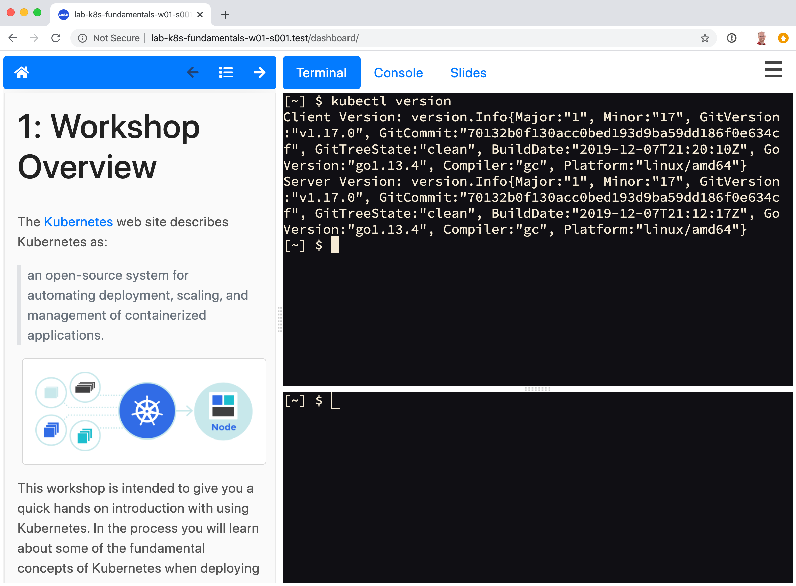

eduk8s
======

The **eduk8s** project provides a system for hosting interactive workshop environments in Kubernetes. It can be used for self paced or supervised workshops where users need access to command line clients and other tools when working with Kubernetes. It can also be useful where you need to package up demos of applications hosted in Kubernetes, for users or potential customers.

Users are provided access to a dashboard combining the workshop content and a shell environment, via a terminal in their web browser. The dashboard can also embed the Kubernetes web console, slide content, or custom web applications.

.. toctree::
  :maxdepth: 2
  :caption: Getting Started:

  getting-started/installing-eduk8s
  getting-started/sample-workshop
  getting-started/deleting-eduk8s

.. toctree::
  :maxdepth: 2
  :caption: Workshop Content:

  workshop-content/workshop-images
  workshop-content/workshop-config
  workshop-content/page-formatting
  workshop-content/presenter-slides

.. toctree::
  :maxdepth: 2
  :caption: Runtime Environment:

  runtime-environment/custom-resources
