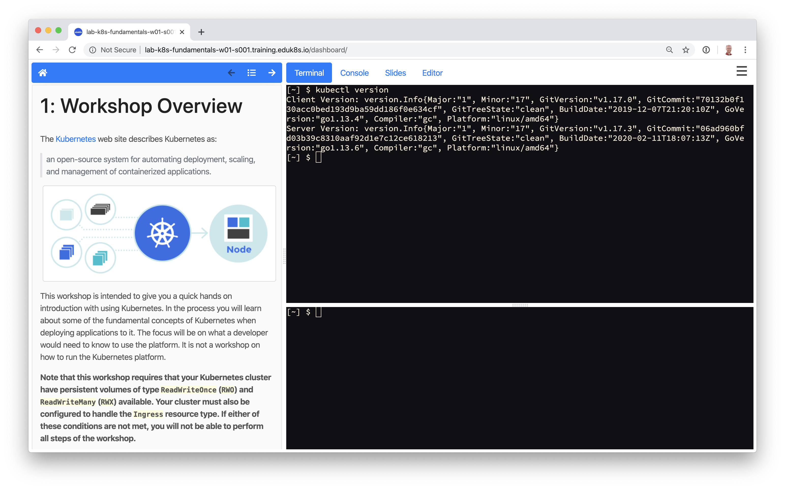
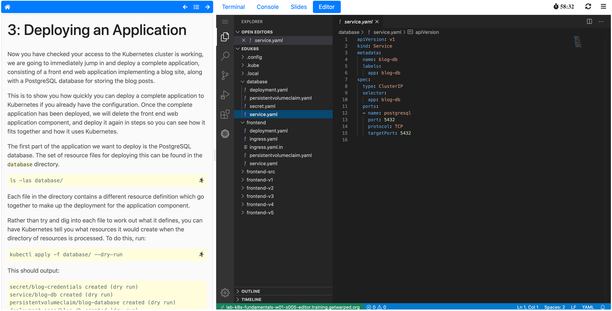
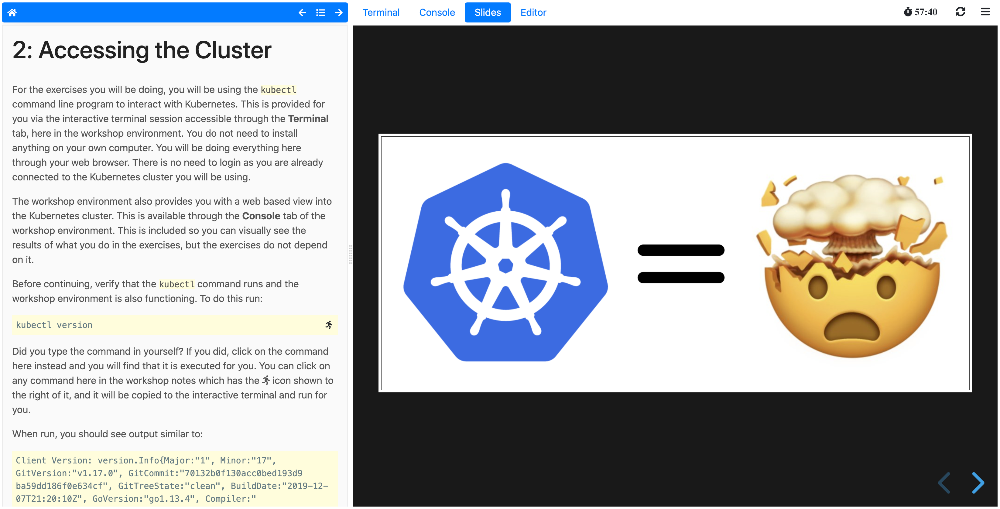
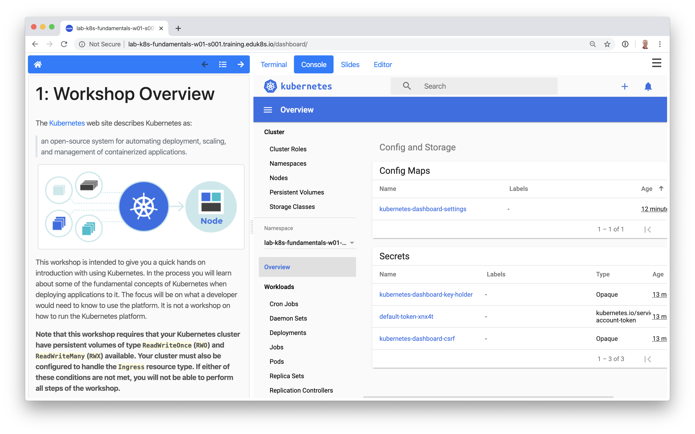
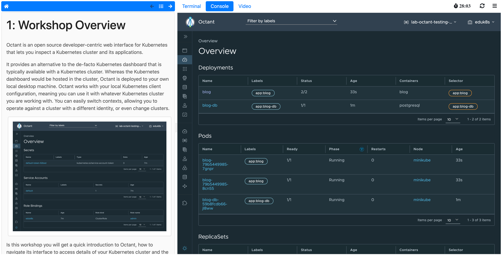

Sample Screenshots
==================

The Educates workshop dashboard comprises a set of workshop instructions on the left hand side and a series of tabbed views on the right hand side. For workshops requiring commands to be run, one or more terminal shells will be provided.

The terminals provide access to the editors ``vi`` and ``nano``, but if you want to provide a UI based editor, you can enable the embedded editor view. The embedded IDE based on VS Code can be used.

To complement the workshop instructions, or to be available for use by the instructor, slides can be included with a workshop. For slides you can use HTML based slide presentation tools such as ``reveal.js``, or you can embed a PDF file.

If the workshop involves working with Kubernetes, you can enable a web console for accessing the Kubernetes cluster. The default web console uses the Kubernetes dashboard.

Alternatively, you can enable Octant as the web console.

